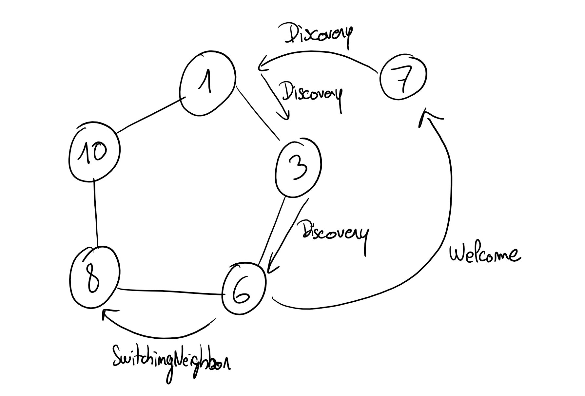
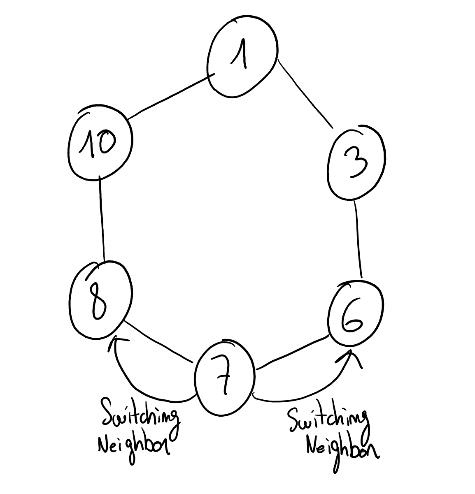
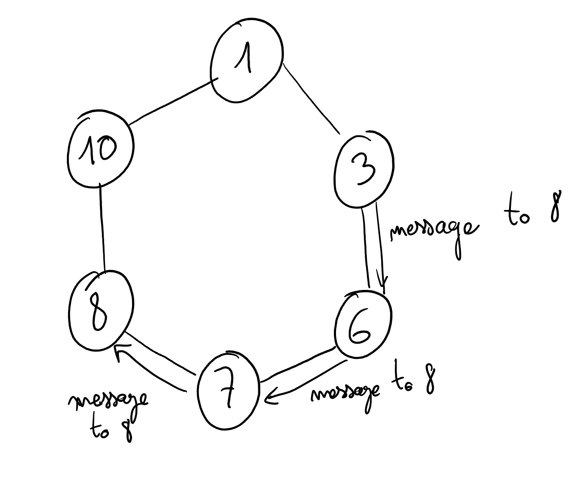
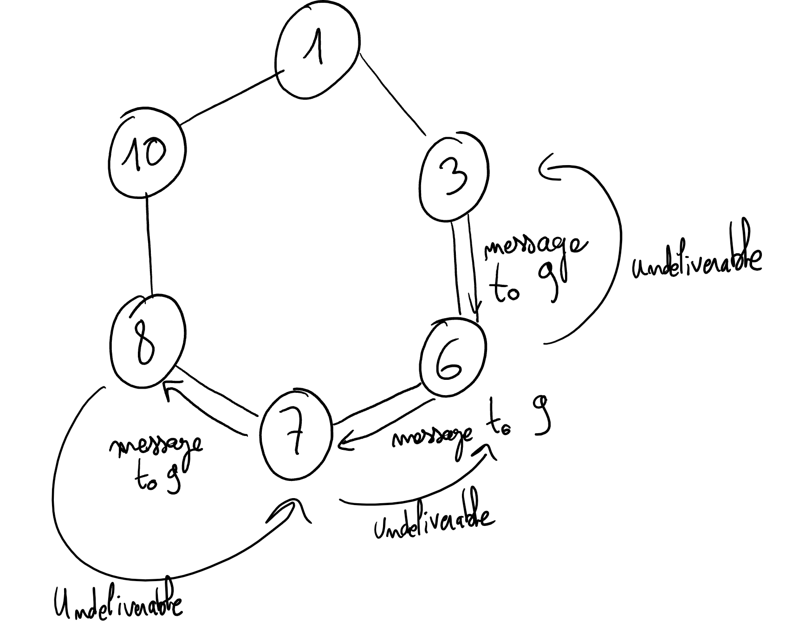

# DHT

> Fait par Damien, Enzo et Théo

**Le but de ce projet est de concevoir et implémenter une DHT en dessus de PeerSim.**

> Pour lancer le projet, il suffit d'executer :
> ```shell
> ./gradlew run
> ```
> Ce ci va compiler tout le code et lancer le simulateur

# Étape 1 : Join/Leave
Dans un premier temps, la DHT est un simple anneau où chaque noeud 
connait uniquement ses voisins immédiats. Chaque noeud a un identifiant 
(aléatoire), les noeuds sont rangés dans l'anneau en fonction de leur 
identifiant. Pour les identifiants on utilise UUID qui va fournir un ID 
unique et aléatoire à chaque noeud. 
Pour faire simple un noeud initial va se réveiller, en suite les autres 
noeuds du Network vont se réveiller un par un et vont trouver leur place 
dans le cercle en parcourant de gauche à droite (gauche = plus petit, 
droite = plus grand). 


## Couche transport
Dans la couche transport nous utilisons un récepteur d'évenement qui va 
rediriger les différents protocoles dans les bonnes méthodes. 
C'est aussi grâce à cette couche que nos noeuds peuvent communiquer.

## Les différents packets
Pour clarifier cela nous utilisons plusieurs types de packets qui héritent tous 
de l'interface Packet :

- **DiscoveryPacket**
> Ce protocole est utilisé lorsqu'un noeud sort de son sommeil. Celui-ci va 
> se propager dans cercle jusqu'à trouver l'emplacement de son émetteur.
- **WelcomePacket**
> Le WelcomePacket est envoyé à un nouveau entrant dans le cercle pour lui 
> présenter ses voisins.
- **SwitchingNeighborPacket** 
> Et enfin ce protocole est utilisé pour avertir un noeud qu'il va changer de 
> voisin (que ce soit pour une entré de noeud ou pour le départ d'un d'entre eux). 

Voici deux dessins pour rendre ça plus visuel. Le premier montre comment un 
noeud rentre dans le network alors que le deuxième montre comment il en sort : 





# Étape 2 : Send/Receive
Pour cette partie nous avons créer un nouveau type de packet : 

- **RoutablePacket**

Celui-ci est divisé en 2 parties : 

- MessagePacket

- UndeliverableRoutablePacket

Le premier est le message qui sera délivré à la target, celui-ci parcourt 
le cercle à la même manière qu'un DiscoveryPacket. 
Si la target n'est pas dans le network alors le noeud qui détecte cette 
'anomalie' va retourner un UndeliverableRoutablePacket au noeud sender.





# Étape 3 : Put/Get 
Cette partie est un peu plus complexe. En effet nous avons fait une deuxième couche 
applicative qui constituera notre hashtable.

Pour cela nous avons donc créer le type de packet suivant : **ApplicationPacket** qui sera à 
destination de la couche applicative.

Si l'on souhaite envoyer un ApplicationPacket sur un autre noeud on passe alors d'abord par 
un RoutablePacket puis lorsque l'on est sur le bon noeud on peut envoyer l'ApplicationPacket sur 
la couche applicative.  

Les Put et Get eux se propagent de la même manière qu'un packet Discovery à la différence que 
ceux-ci utilisent le hash au lieu du UUID. 


# Les outils utilisés 
Dans un premier temps nous utilisions le Makefile pour compiler et tester 
notre code mais nous nous sommes vite rendu compte que cela n'était pas 
pratique et que le debug était impossible. Nous avons donc utiliser 
**Gradle** simplifier cela. 

Toujours dans une optique d'efficacité nous avons utilisé **Log4J** pour 
avoir des logs propres et utilisables. 

# Résultats avec les logs 

Les logs sont découpés en plusieurs actions pour faciliter leur lecture (Les logs sont aussi
colorés dans la console, des screens sont disponibles dans [le dossier img](img).

Ici on voit l'initialisation d'un network avec un noeud puis l'ajout de
deux noeuds dans ce même network (Action 0 et Action 1).

```prolog
[INFO ] Initializer: Creating initializer init.project
[INFO ] Initializer: Starting simulation
[INFO ] Initializer: Initializing first node
[INFO ] Transport b88c632a1523481c (Node 0): Awaken as initial node
[INFO ] Initializer: Done
[INFO ] Node Controller: ======================== [Action 0] ========================
[INFO ] Node Controller: Waking up node 1
[DEBUG] Transport d69b620e2b3e4bb2 (Node 1): Starting discovery, contacting node 0 (b88c632a-1523-481c-b029-b3f8375b740c) and waiting for response
[INFO ] Node Controller: bootstrapped Transport(idle=true, localNode=1, left=null, right=null, id=d69b620e-2b3e-4bb2-86b5-70392be84e7c)
[TRACE] Transport b88c632a1523481c (Node 0): Received packet: Packet.DiscoveryPacket(address=1, nodeId=d69b620e-2b3e-4bb2-86b5-70392be84e7c)
[DEBUG] Transport b88c632a1523481c (Node 0): Joining 1 to form a ring of size 2
[TRACE] Transport d69b620e2b3e4bb2 (Node 1): Received packet: Packet.WelcomePacket(left=0, right=0)
[DEBUG] Transport d69b620e2b3e4bb2 (Node 1): Awaken and joined the ring (left=0, right=0)
[DEBUG] Transport d69b620e2b3e4bb2 (Node 1): The ring has now a size of 2
[INFO ] Node Controller: ======================== [Action 1] ========================
[INFO ] Node Controller: Waking up node 2
[DEBUG] Transport 23ef126592904ccb (Node 2): Starting discovery, contacting node 1 (d69b620e-2b3e-4bb2-86b5-70392be84e7c) and waiting for response
[INFO ] Node Controller: bootstrapped Transport(idle=true, localNode=2, left=null, right=null, id=23ef1265-9290-4ccb-9cd5-9c35c510c8d0)
[TRACE] Transport d69b620e2b3e4bb2 (Node 1): Received packet: Packet.DiscoveryPacket(address=2, nodeId=23ef1265-9290-4ccb-9cd5-9c35c510c8d0)
[DEBUG] Transport d69b620e2b3e4bb2 (Node 1): Welcoming node 2 (23ef1265-9290-4ccb-9cd5-9c35c510c8d0) as my new right node
[DEBUG] Transport d69b620e2b3e4bb2 (Node 1): Notifying node 0 (b88c632a-1523-481c-b029-b3f8375b740c) of their new left node
[TRACE] Transport 23ef126592904ccb (Node 2): Received packet: Packet.WelcomePacket(left=1, right=0)
[DEBUG] Transport 23ef126592904ccb (Node 2): Awaken and joined the ring (left=1, right=0)
[DEBUG] Transport 23ef126592904ccb (Node 2): The ring has now a size of 3
[TRACE] Transport b88c632a1523481c (Node 0): Received packet: Packet.SwitchNeighborPacket(left=true, address=2)
[DEBUG] Transport b88c632a1523481c (Node 0): Switching left neighbor from 1 to 2
```

Sur l'action 9 que l'on voit au-dessus le final ring est représenté. 
On voit que tous les noeuds sont dans le bon ordre d'UUID.
**ATTENTION on ne commence pas forcément avec le plus petit, pas grave c'est un cercle :).**

```prolog
[INFO ] Node Controller: Final ring: b88c632a-1523-481c-b029-b3f8375b740c (0) ⇒ cc0cb9bb-0514-460b-b555-f8a60502a379 (3) ⇒ d69b620e-2b3e-4bb2-86b5-70392be84e7c (1) ⇒ e634f2e9-7e42-4b55-a495-083166d7518b (8) ⇒ 23ef1265-9290-4ccb-9cd5-9c35c510c8d0 (2) ⇒ 25900288-e302-43d7-a754-0eeea294a16e (7) ⇒ 2e61642b-cf2c-4a0d-a008-b4f66e1f8859 (5) ⇒ 32070974-0cf8-49cc-ab0a-ed8b9a459c0a (6) ⇒ 4314c08f-70e8-4dbf-8c95-47fe074e8ced (4) ⇒ 8c956f21-dfd1-4412-a8ea-33695adf18ed (9)
```

Ici on enlève le noeud 0 du ring. 

```prolog
[INFO ] Node Controller: ======================== [Action 10] ========================
[INFO ] Node Controller: Killing node 0
[INFO ] Transport b88c632a1523481c (Node 0): Leaving the ring (notifying neighbors)
[TRACE] Transport 8c956f21dfd14412 (Node 9): Received packet: Packet.SwitchNeighborPacket(left=false, address=3)
[DEBUG] Transport 8c956f21dfd14412 (Node 9): Switching right neighbor from 0 to 3
[TRACE] Transport cc0cb9bb0514460b (Node 3): Received packet: Packet.SwitchNeighborPacket(left=true, address=9)
[DEBUG] Transport cc0cb9bb0514460b (Node 3): Switching left neighbor from 0 to 9
```

Et enfin on envoie un message du noeud 9 au noeud 6, on voit que l'ordre de 
routing du packet est bon. On remarque aussi que la suppression à bien fonctionner car 
initialement le packet aurait dû passer par le noeud 0.

```prolog
[INFO ] Node Controller: ======================== [Action 11] ========================
[INFO ] Node Controller: Sending `Hello world` from 8c956f21-dfd1-4412-a8ea-33695adf18ed (9) to 32070974-0cf8-49cc-ab0a-ed8b9a459c0a (6)
[TRACE] Transport 8c956f21dfd14412 (Node 9): Routing packet to right: 3 (cc0cb9bb-0514-460b-b555-f8a60502a379)
[TRACE] Transport cc0cb9bb0514460b (Node 3): Received packet: RoutablePacket.MessagePacket(sender=8c956f21-dfd1-4412-a8ea-33695adf18ed, target=32070974-0cf8-49cc-ab0a-ed8b9a459c0a, message=Hello world)
[TRACE] Transport cc0cb9bb0514460b (Node 3): Routing packet to right: 1 (d69b620e-2b3e-4bb2-86b5-70392be84e7c)
[TRACE] Transport d69b620e2b3e4bb2 (Node 1): Received packet: RoutablePacket.MessagePacket(sender=8c956f21-dfd1-4412-a8ea-33695adf18ed, target=32070974-0cf8-49cc-ab0a-ed8b9a459c0a, message=Hello world)
[TRACE] Transport d69b620e2b3e4bb2 (Node 1): Routing packet to right: 8 (e634f2e9-7e42-4b55-a495-083166d7518b)
[TRACE] Transport e634f2e97e424b55 (Node 8): Received packet: RoutablePacket.MessagePacket(sender=8c956f21-dfd1-4412-a8ea-33695adf18ed, target=32070974-0cf8-49cc-ab0a-ed8b9a459c0a, message=Hello world)
[TRACE] Transport e634f2e97e424b55 (Node 8): Routing packet to right: 2 (23ef1265-9290-4ccb-9cd5-9c35c510c8d0)
[TRACE] Transport 23ef126592904ccb (Node 2): Received packet: RoutablePacket.MessagePacket(sender=8c956f21-dfd1-4412-a8ea-33695adf18ed, target=32070974-0cf8-49cc-ab0a-ed8b9a459c0a, message=Hello world)
[TRACE] Transport 23ef126592904ccb (Node 2): Routing packet to right: 7 (25900288-e302-43d7-a754-0eeea294a16e)
[TRACE] Transport 25900288e30243d7 (Node 7): Received packet: RoutablePacket.MessagePacket(sender=8c956f21-dfd1-4412-a8ea-33695adf18ed, target=32070974-0cf8-49cc-ab0a-ed8b9a459c0a, message=Hello world)
[TRACE] Transport 25900288e30243d7 (Node 7): Routing packet to right: 5 (2e61642b-cf2c-4a0d-a008-b4f66e1f8859)
[TRACE] Transport 2e61642bcf2c4a0d (Node 5): Received packet: RoutablePacket.MessagePacket(sender=8c956f21-dfd1-4412-a8ea-33695adf18ed, target=32070974-0cf8-49cc-ab0a-ed8b9a459c0a, message=Hello world)
[TRACE] Transport 2e61642bcf2c4a0d (Node 5): Routing packet to right: 6 (32070974-0cf8-49cc-ab0a-ed8b9a459c0a)
[TRACE] Transport 320709740cf849cc (Node 6): Received packet: RoutablePacket.MessagePacket(sender=8c956f21-dfd1-4412-a8ea-33695adf18ed, target=32070974-0cf8-49cc-ab0a-ed8b9a459c0a, message=Hello world)
[INFO ] Transport 320709740cf849cc (Node 6): Received a message from 8c956f21-dfd1-4412-a8ea-33695adf18ed: Hello world
```

Pour la question 3, on voit aussi la suite des packet permettant le PUT et le GET dans la DHT

```prolog
[INFO ] Node Controller: ======================== [Action 14] ========================
[INFO ] Node Controller: Inserting key/value in the dht: La clef/La valeur
[TRACE] Transport cc0cb9bb0514460b (Node 3): Received packet: ApplicationPacket.PutPacket(key=La clef, value=La valeur)
[TRACE] Transport d69b620e2b3e4bb2 (Node 1): Received packet: ApplicationPacket.PutPacket(key=La clef, value=La valeur)
[TRACE] Transport e634f2e97e424b55 (Node 8): Received packet: ApplicationPacket.PutPacket(key=La clef, value=La valeur)
[TRACE] Transport 23ef126592904ccb (Node 2): Received packet: ApplicationPacket.PutPacket(key=La clef, value=La valeur)
[TRACE] Transport 25900288e30243d7 (Node 7): Received packet: ApplicationPacket.PutPacket(key=La clef, value=La valeur)
[TRACE] Transport 2e61642bcf2c4a0d (Node 5): Received packet: ApplicationPacket.PutPacket(key=La clef, value=La valeur)
[TRACE] Transport 320709740cf849cc (Node 6): Received packet: ApplicationPacket.PutPacket(key=La clef, value=La valeur)
[TRACE] Transport 4314c08f70e84dbf (Node 4): Received packet: ApplicationPacket.PutPacket(key=La clef, value=La valeur)
[DEBUG] HashTable 4314c08f70e84dbf (Node 4): Stored value for `La clef` (hash: 5bd13e75)
[TRACE] Transport 320709740cf849cc (Node 6): Received packet: ApplicationPacket.ReplicationPacket(key=La clef, value=La valeur)
[DEBUG] HashTable 320709740cf849cc (Node 6): Replicated storage for `La valeur`
[TRACE] Transport 8c956f21dfd14412 (Node 9): Received packet: ApplicationPacket.ReplicationPacket(key=La clef, value=La valeur)
[DEBUG] HashTable 8c956f21dfd14412 (Node 9): Replicated storage for `La valeur`
[INFO ] Node Controller: ======================== [Action 15] ========================
[INFO ] Node Controller: Fetching `La clef` from the DHT
[TRACE] Transport cc0cb9bb0514460b (Node 3): Received packet: ApplicationPacket.GetPacket(sender=8c956f21-dfd1-4412-a8ea-33695adf18ed, key=La clef)
[TRACE] Transport d69b620e2b3e4bb2 (Node 1): Received packet: ApplicationPacket.GetPacket(sender=8c956f21-dfd1-4412-a8ea-33695adf18ed, key=La clef)
[TRACE] Transport e634f2e97e424b55 (Node 8): Received packet: ApplicationPacket.GetPacket(sender=8c956f21-dfd1-4412-a8ea-33695adf18ed, key=La clef)
[TRACE] Transport 23ef126592904ccb (Node 2): Received packet: ApplicationPacket.GetPacket(sender=8c956f21-dfd1-4412-a8ea-33695adf18ed, key=La clef)
[TRACE] Transport 25900288e30243d7 (Node 7): Received packet: ApplicationPacket.GetPacket(sender=8c956f21-dfd1-4412-a8ea-33695adf18ed, key=La clef)
[TRACE] Transport 2e61642bcf2c4a0d (Node 5): Received packet: ApplicationPacket.GetPacket(sender=8c956f21-dfd1-4412-a8ea-33695adf18ed, key=La clef)
[TRACE] Transport 320709740cf849cc (Node 6): Received packet: ApplicationPacket.GetPacket(sender=8c956f21-dfd1-4412-a8ea-33695adf18ed, key=La clef)
[TRACE] Transport 4314c08f70e84dbf (Node 4): Received packet: ApplicationPacket.GetPacket(sender=8c956f21-dfd1-4412-a8ea-33695adf18ed, key=La clef)
[TRACE] Transport 4314c08f70e84dbf (Node 4): Routing packet to left: 6 (32070974-0cf8-49cc-ab0a-ed8b9a459c0a)
[TRACE] Transport 320709740cf849cc (Node 6): Received packet: ApplicationPacket.GetResponsePacket(sender=4314c08f-70e8-4dbf-8c95-47fe074e8ced, target=8c956f21-dfd1-4412-a8ea-33695adf18ed, key=La clef, value=La valeur)
[TRACE] Transport 320709740cf849cc (Node 6): Routing packet to left: 5 (2e61642b-cf2c-4a0d-a008-b4f66e1f8859)
[TRACE] Transport 2e61642bcf2c4a0d (Node 5): Received packet: ApplicationPacket.GetResponsePacket(sender=4314c08f-70e8-4dbf-8c95-47fe074e8ced, target=8c956f21-dfd1-4412-a8ea-33695adf18ed, key=La clef, value=La valeur)
[TRACE] Transport 2e61642bcf2c4a0d (Node 5): Routing packet to left: 7 (25900288-e302-43d7-a754-0eeea294a16e)
[TRACE] Transport 25900288e30243d7 (Node 7): Received packet: ApplicationPacket.GetResponsePacket(sender=4314c08f-70e8-4dbf-8c95-47fe074e8ced, target=8c956f21-dfd1-4412-a8ea-33695adf18ed, key=La clef, value=La valeur)
[TRACE] Transport 25900288e30243d7 (Node 7): Routing packet to left: 2 (23ef1265-9290-4ccb-9cd5-9c35c510c8d0)
[TRACE] Transport 23ef126592904ccb (Node 2): Received packet: ApplicationPacket.GetResponsePacket(sender=4314c08f-70e8-4dbf-8c95-47fe074e8ced, target=8c956f21-dfd1-4412-a8ea-33695adf18ed, key=La clef, value=La valeur)
[TRACE] Transport 23ef126592904ccb (Node 2): Routing packet to left: 8 (e634f2e9-7e42-4b55-a495-083166d7518b)
[TRACE] Transport e634f2e97e424b55 (Node 8): Received packet: ApplicationPacket.GetResponsePacket(sender=4314c08f-70e8-4dbf-8c95-47fe074e8ced, target=8c956f21-dfd1-4412-a8ea-33695adf18ed, key=La clef, value=La valeur)
[TRACE] Transport e634f2e97e424b55 (Node 8): Routing packet to left: 1 (d69b620e-2b3e-4bb2-86b5-70392be84e7c)
[TRACE] Transport d69b620e2b3e4bb2 (Node 1): Received packet: ApplicationPacket.GetResponsePacket(sender=4314c08f-70e8-4dbf-8c95-47fe074e8ced, target=8c956f21-dfd1-4412-a8ea-33695adf18ed, key=La clef, value=La valeur)
[TRACE] Transport d69b620e2b3e4bb2 (Node 1): Routing packet to left: 3 (cc0cb9bb-0514-460b-b555-f8a60502a379)
[TRACE] Transport cc0cb9bb0514460b (Node 3): Received packet: ApplicationPacket.GetResponsePacket(sender=4314c08f-70e8-4dbf-8c95-47fe074e8ced, target=8c956f21-dfd1-4412-a8ea-33695adf18ed, key=La clef, value=La valeur)
[TRACE] Transport cc0cb9bb0514460b (Node 3): Routing packet to left: 9 (8c956f21-dfd1-4412-a8ea-33695adf18ed)
[TRACE] Transport 8c956f21dfd14412 (Node 9): Received packet: ApplicationPacket.GetResponsePacket(sender=4314c08f-70e8-4dbf-8c95-47fe074e8ced, target=8c956f21-dfd1-4412-a8ea-33695adf18ed, key=La clef, value=La valeur)
[INFO ] Node Controller: For key `La clef`, got: La valeur
```
